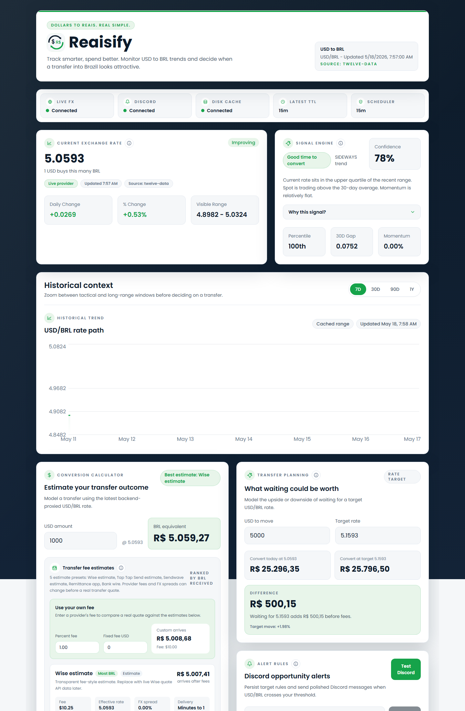
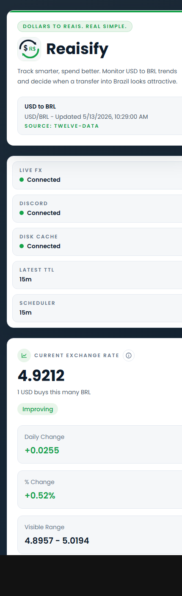

# Reaisify

Reaisify is a production-minded React SPA and Node API for helping people decide when to move money internationally, starting with the USD/BRL corridor for a move from the United States to Brazil.

This MVP is intentionally more than a simple converter. It combines current pricing, historical context, percentile-based timing signals, and local alert rule persistence into a reusable FX dashboard architecture.

## Screenshots

### Desktop Dashboard



### Mobile Dashboard



## Stack

- Frontend: React, TypeScript, Vite, TailwindCSS, Recharts
- Backend: Node.js, TypeScript, Express
- Infrastructure: Docker, docker-compose

## Ports

- Frontend: `http://localhost:7000`
- Backend API: `http://localhost:7001`
- Reserved for future use:
  - Postgres: `localhost:7002`
  - Redis: `localhost:7003`

## Project Structure

```text
currency-tracker/
  frontend/
  backend/
  docker-compose.yml
  README.md
```

## Features

- Current USD to BRL rate card with daily change and percentage move
- Historical chart with `7D`, `30D`, `90D`, and `1Y` ranges
- Real-time USD to BRL conversion calculator with estimated and custom transfer fee comparisons
- Signal engine with recommendation, confidence, reasoning, percentile, and trend direction
- Backend-managed alert rules with durable storage and Discord webhook support
- Reusable pair-oriented architecture for future currency pairs like `usd-eur` and `usd-gbp`
- Backend provider abstraction with Twelve Data as the primary near-real-time source
- In-memory TTL caching for latest and historical provider responses

## Architecture Overview

### Frontend

- `src/services/fxService.ts`: calls backend proxy endpoints for latest, history, and signal data
- `src/hooks/useExchangeRates.ts`: fetches and filters pair data by time range
- `src/utils/signalEngine.ts`: encapsulates timing analysis logic
- `src/utils/transferFees.ts`: provider-agnostic transfer fee estimation rules
- `src/components/*`: presentation-focused UI building blocks
- `src/types/currency.ts`: pair-agnostic interfaces for series, snapshots, alerts, and signals

### Backend

- `src/routes/fxRoutes.ts`: route layer for `/latest`, `/history`, and `/signal`
- `src/services/fxService.ts`: caching and provider orchestration
- `src/providers/MockFxProvider.ts`: local fallback dataset provider
- `src/providers/TwelveDataFxProvider.ts`: Twelve Data adapter
- `src/providers/FutureProvider.ts`: placeholder for future live provider integrations
- `src/services/cacheService.ts`: in-memory TTL caching
- `src/server.ts`: API bootstrap with `GET /health` and the `/fx/:pairSymbol/*` endpoints

### Reusability

The current implementation uses `usd-brl`, but the data model and service layer are designed around `pairSymbol`, `base`, and `quote` so the same pipeline can support additional corridors later.

## Getting Started

### Environment setup

The backend expects the Twelve Data key in [backend/.env](C:/Users/steph/dev/currency-tracker/backend/.env:1):

```env
TWELVE_DATA_API_KEY=your-twelve-data-api-key
PORT=7001
ALERT_STORAGE_DIR=./runtime
FX_LATEST_CACHE_TTL_MS=900000
FX_HISTORY_CACHE_TTL_MS=86400000
FX_CACHE_PERSISTENCE=true
FX_CACHE_FILE_NAME=fx-cache.json
PROVIDER_USAGE_CACHE_TTL_MS=3600000
ALERT_POLL_INTERVAL_MS=900000
ALERT_RUN_ON_STARTUP=false
DISCORD_WEBHOOK_URL=
```

The API key is only used server-side and is never exposed to the frontend. The Discord webhook is also backend-only.

### Local development without Docker

1. Install frontend dependencies:
   - `cd frontend`
   - `npm install`
2. Start the frontend:
   - `npm run dev`
3. Install backend dependencies in a second terminal:
   - `cd backend`
   - `npm install`
4. Start the backend:
   - `npm run dev`

### Docker development

Run the full stack with hot reload:

```bash
docker compose up --build
```

This starts:

- Frontend on `localhost:7000`
- Backend on `localhost:7001`

Persistence in Docker:

- `./backend/runtime` stores alert state and delivery logs
- `postgres_data` persists Postgres when the future profile is enabled
- `redis_data` persists Redis when the future profile is enabled

Reserved future services can be enabled later using the `future` compose profile.

## API Endpoints

### `GET /health`

Returns API health metadata.

### `GET /status`

Returns runtime flags for live FX, Discord webhook configuration, alert storage, and scheduler interval.

### `GET /status/provider-usage`

Returns the latest persisted provider credit snapshot. Twelve Data usage is captured from normal response headers when available, so this endpoint does not spend an additional provider credit.

### `GET /status/provider-usage?refresh=true`

Manually refreshes Twelve Data usage via the provider usage endpoint and caches the result for `PROVIDER_USAGE_CACHE_TTL_MS`. Use sparingly because Twelve Data counts this request against API credits.

### `GET /fx/usd-brl/latest`

Returns the latest proxied USD/BRL rate from Twelve Data when configured, otherwise the mock provider.

### `GET /fx/usd-brl/history?range=7D|30D|90D|1Y`

Returns historical daily points for the requested range.

### `GET /fx/usd-brl/signal`

Returns the structured timing recommendation derived from moving averages, percentile rank, and momentum.

### `GET /alerts?pairSymbol=usd-brl`

Returns alert rules for a currency pair.

### `POST /alerts`

Creates a new alert rule.

```json
{
  "pairSymbol": "usd-brl",
  "targetRate": 5.4
}
```

### `DELETE /alerts/:id`

Deletes an alert rule.

### `POST /alerts/test-discord`

Sends a manual Discord test notification using the latest rate and signal for a pair. This is intended for validating webhook setup without waiting for a threshold crossing.

## Signal Engine Logic

The timing recommendation uses:

- 7-day and 30-day moving averages
- percentile ranking inside the recent 30-day range
- current position versus recent highs and lows
- momentum and trend direction

Recommendation rules:

- `GOOD`: current rate is above the 75th percentile and above the 30-day average
- `NEUTRAL`: current rate is between strong positive and weak negative conditions
- `WAIT`: current rate is below the 40th percentile and below the 30-day average

The engine returns:

```ts
{
  recommendation: "GOOD" | "NEUTRAL" | "WAIT",
  confidence: number,
  reasoning: string
}
```

## Provider Strategy

Primary live provider:

- Twelve Data

Provider abstraction:

- `MockFxProvider`
- `TwelveDataFxProvider`
- `FutureProvider`

The service layer selects Twelve Data when `TWELVE_DATA_API_KEY` is present and falls back to mock data otherwise.

## Caching

- Latest rate cache TTL: 15 minutes by default
- Historical cache TTL: 24 hours by default
- Alert scheduler polling: 15 minutes by default
- FX cache persistence: enabled by default in `backend/runtime/fx-cache.json`
- Provider usage snapshot: persisted in `backend/runtime/provider-usage.json`

These defaults intentionally conserve Twelve Data free-tier credits while the app is under active development. The persisted cache also survives backend container restarts, so refreshing Docker does not immediately force new provider calls while cached data is still valid. Lower `FX_LATEST_CACHE_TTL_MS` or `ALERT_POLL_INTERVAL_MS` only when you need fresher live checks.

## Alerting

- Alert rules are stored in `backend/runtime/alerts.json`
- Delivery history is appended to `backend/runtime/alert-deliveries.log`
- The backend polls active rules on `ALERT_POLL_INTERVAL_MS`
- Startup alert checks are disabled by default with `ALERT_RUN_ON_STARTUP=false` to avoid spending an API credit every container restart
- Discord notifications fire when a rule crosses from below target to above target
- If `DISCORD_WEBHOOK_URL` is unset, the backend still records the opportunity to the log file

## Transfer Fee Estimates

The converter includes configurable transfer provider presets for comparing estimated BRL received after fees. Current presets model fixed fees, percentage fees, and FX spread/markup separately for scenarios like Wise-style transfers, remittance apps, and bank wires.

Users can also enter a custom percentage fee and fixed USD fee when they already know their provider's pricing. This makes the calculator useful for comparing a real quote against the preset scenarios.

These are decision-support estimates, not live provider quotes. A future provider adapter can replace the presets with live Wise or other remittance quote APIs while keeping the UI contract intact.

## Mock Data Strategy

Mock data is generated programmatically for 365 daily observations with:

- bounded volatility
- cyclical swings
- directional drift
- small shocks to simulate real market noise

This makes it easy to replace with live API data later while keeping the UI stable.

## Future Improvements

- Plug in live FX providers such as ExchangeRate.host, Open Exchange Rates, or Wise
- Add multi-pair dashboards and portfolio views
- Add scheduled transfer suggestions and recurring remittance planning
- Integrate live remittance quotes from providers such as Wise for exact fee comparisons
- Add push notifications, email alerts, or Discord/webhook delivery through a backend jobs system
- Introduce Postgres for user data and alert persistence
- Add Redis caching for FX responses and signal computations
- Layer in forecasting or AI-assisted scenario analysis
- Support user accounts, saved preferences, and historical transfer journals

## API Integration Guidance

When replacing mock data:

1. Keep the API contract returned by `backend/src/services/fxService.ts`.
2. Swap `mockHistoricalRates` for a provider adapter module.
3. Normalize upstream payloads into the existing latest/history/signal response shapes.
4. Add caching and rate-limit protection before calling external APIs in production.
5. Move file-backed alerts into Postgres once authentication exists.

## Notes

- The Discord webhook should be configured through `backend/.env` and is intentionally kept out of frontend code.
- The frontend includes a fallback to mock data so the dashboard still renders if the backend is unavailable during UI development.
